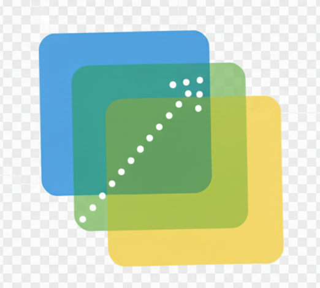
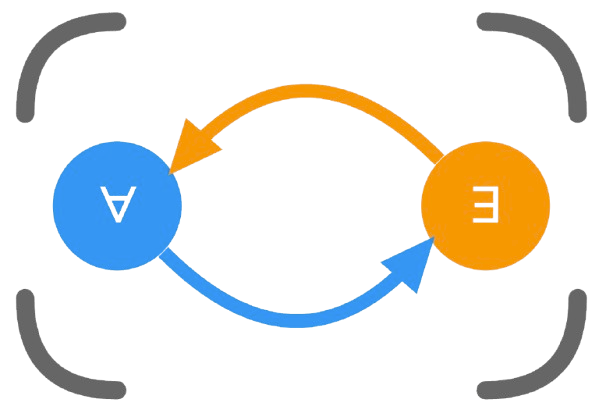
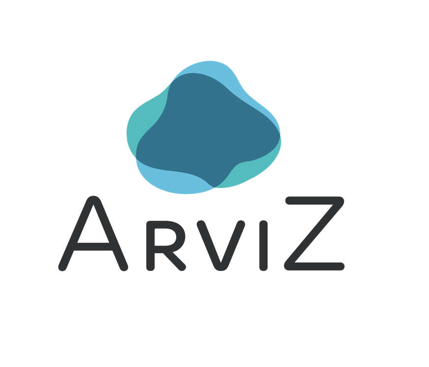
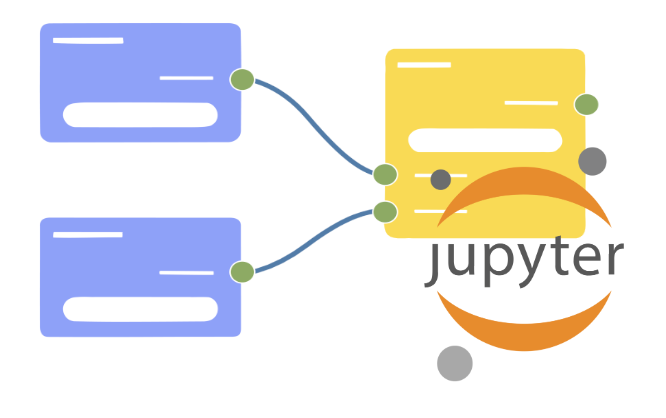

## Hi there, I am [Yilin Xia](https://yilinxia.com/)

I am a Ph.D. student advised by Dr. Bertram Ludäscher and Dr. Matthew Turk in the School of Information Sciences at the University of Illinois at Urbana-Champaign.

My work focuses on Data Management, Data Visualization, and Knowledge Representation & Reasoning, where I aim to address data challenges using Declarative Approaches.

I receive support in part from the GitHub Secure Open Source Fund, Google Academic Research Grants, the Gemini Academic Program, and NumFOCUS Small Development Grants.
<table>
<tr height="320px">
<td>
<table>
  <tr height="100px">
    <td colspan="4" align="center" valign="middle">
      
    </td>
  </tr>
  <tr height="120px">
    <td width="250px" colspan="4" valign="top" style="padding: 10px; font-size: 12px;">
      <a href="https://github.com/data-exp-lab/deepgit"><strong>DeepGit</strong></a>: Exploration and Discovery of Research Software with Human-Curated Graphs
        ⚡ Vis Interface, GraphRAG
    </td>
  </tr>
  
<tr height="40px">
  
<td align="center" style="padding: 10px;">
  
</td>
  <td align="center" style="padding: 10px;">
     10
  </td>
</tr>
</table>
</td>
<td>
<table>
  <tr height="100px">
    <td colspan="4" align="center" valign="middle">
      
    </td>
  </tr>
  <tr height="120px">
    <td width="250px" colspan="4" valign="top" style="padding: 10px; font-size: 12px;">
      <a href="https://github.com/yilinxia/DecViz"><strong>DecViz</strong></a>: Transforms knowledge into graphs using declarative programming language
        ⚡ Formalization, Visualization
    </td>
  </tr>
  
<tr height="40px">
  <td align="center" valign="middle" style="padding: 10px;"></td>
  <td align="center" style="padding: 10px;">
     0
  </td>
</tr>
</table>
</td>
<td>
<table>
  <tr height="100px">
    <td colspan="4" align="center" valign="middle">
      
    </td>
  </tr>
  <tr height="120px">
    <td width="250px" colspan="4" valign="top" style="padding: 10px; font-size: 12px;">
      <a href="https://github.com/evgskv/logica"><strong>Logica</strong></a>: A logic programming language that compiles to SQL, runs on DuckDB etc. (EDBT'24)
        ⚡ Query, Logic Programming
    </td>
  </tr>
  
<tr height="40px">
  
<td align="center" style="padding: 10px;">
  
</td>
  <td align="center" style="padding: 10px;">
     2078
  </td>
</tr>
</table>
</td>
</tr>
<tr height="320px">
<td>
<table>
  <tr height="100px">
    <td colspan="4" align="center" valign="middle">
      
    </td>
  </tr>
  <tr height="120px">
    <td width="250px" colspan="4" valign="top" style="padding: 10px; font-size: 12px;">
      <a href="https://github.com/idaks/xray"><strong>XRAY</strong></a>: A visual interface designed to Instantiate and Explain Abstract AF (ICAIL'25)
        ⚡ Graph Reasoning, XAI
    </td>
  </tr>
  
<tr height="40px">
  
<td align="center" style="padding: 10px;">
  
</td>
  <td align="center" style="padding: 10px;">
     2
  </td>
</tr>
</table>
</td>
<td>
<table>
  <tr height="100px">
    <td colspan="4" align="center" valign="middle">
      
    </td>
  </tr>
  <tr height="120px">
    <td width="250px" colspan="4" valign="top" style="padding: 10px; font-size: 12px;">
      <a href="https://github.com/xai-ca/argsemx"><strong>ArgSemX</strong></a>: An interactive web app for instantiating and exploring abstract AF semantics
        ⚡ AF Semantics
    </td>
  </tr>
  
<tr height="40px">
  <td align="center" valign="middle" style="padding: 10px;"></td>
  <td align="center" style="padding: 10px;">
     1
  </td>
</tr>
</table>
</td>
<td>
<table>
  <tr height="100px">
    <td colspan="4" align="center" valign="middle">
      
    </td>
  </tr>
  <tr height="120px">
    <td width="250px" colspan="4" valign="top" style="padding: 10px; font-size: 12px;">
      <a href="https://go.illinois.edu/crowdidea"><strong>CrowdIdea</strong></a>: Application fuses crowd insights, analytics, and causal exploration. (CHI'23)
        ⚡ Causal Graphs, Viz
    </td>
  </tr>
  
<tr height="40px">
  
<td align="center" style="padding: 10px;">
  
</td>
  <td align="center" style="padding: 10px;">
    
  </td>
</tr>
</table>
</td>
</tr>
<tr height="320px">
<td>
<table>
  <tr height="100px">
    <td colspan="4" align="center" valign="middle">
      
    </td>
  </tr>
  <tr height="120px">
    <td width="250px" colspan="4" valign="top" style="padding: 10px; font-size: 12px;">
      <a href="https://github.com/arviz-devs/arviz_dashboard"><strong>ArviZ Dashboard</strong></a>: Bayesian Dashboard for exploratory analysis of Bayesian models
        ⚡ Bayesian Analysis, Panel
    </td>
  </tr>
  
<tr height="40px">
  <td align="center" valign="middle" style="padding: 10px;"></td>
  <td align="center" style="padding: 10px;">
     8
  </td>
</tr>
</table>
</td>
<td>
<table>
  <tr height="100px">
    <td colspan="4" align="center" valign="middle">
      
    </td>
  </tr>
  <tr height="120px">
    <td width="250px" colspan="4" valign="top" style="padding: 10px; font-size: 12px;">
      <a href="https://github.com/xability/maidr"><strong>MAIDR</strong></a>: Interactive and Multi-Modal Approaches to Accessible Data Viz (CHI'24)
        ⚡ A11y, Multi-modal
    </td>
  </tr>
  
<tr height="40px">
  
<td align="center" style="padding: 10px;">
  
</td>
  <td align="center" style="padding: 10px;">
     17
  </td>
</tr>
</table>
</td>
<td>
<table>
  <tr height="100px">
    <td colspan="4" align="center" valign="middle">
      
    </td>
  </tr>
  <tr height="120px">
    <td width="250px" colspan="4" valign="top" style="padding: 10px; font-size: 12px;">
      <a href="https://github.com/cropsinsilico/jupyterlab_nodeeditor"><strong>JLNE</strong></a>: Node-based Visual Programming Powered Jupyter Extension for Experts
        ⚡ VVVV, Extension
    </td>
  </tr>
  
<tr height="40px">
  <td align="center" valign="middle" style="padding: 10px;"></td>
  <td align="center" style="padding: 10px;">
     6
  </td>
</tr>
</table>
</td>
</tr>
</table>