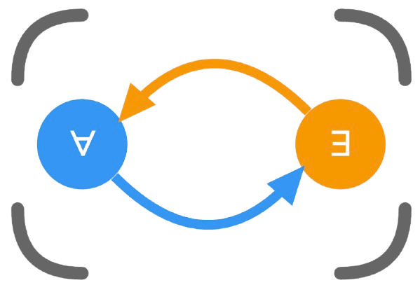

## Hi there, I am [Yilin Xia](https://yilinxia.com/)

I am a Ph.D. student advised by Dr. Bertram Ludäscher and Dr. Matthew Turk in the School of Information Sciences at the University of Illinois at Urbana-Champaign.

My work addresses fundamental challenges in querying, reasoning over, and explaining graph-structured knowledge. I utilize  Neuro-Symbolic Approaches that combine symbolic logic with large language models, enabling scalable analytics, hybrid retrieval, and explainable multi-agent interaction. 

I receive support in part from the GitHub Secure Open Source Fund, Google Academic Research Grants, the Gemini Academic Program, and NumFOCUS Small Development Grants.

<table>
<tr height="320px">
<td>
<table>
<tr height="100px">
<td colspan="4" align="center" valign="middle">

</td>
</tr>
<tr height="120px">
<td width="250px" colspan="4" valign="top" style="padding: 10px; font-size: 12px;">
<a href="https://github.com/evgskv/logica"><strong>Logica</strong></a>: A logic programming language that compiles to SQL, runs on DuckDB etc. (EDBT'24)
  ⚡ Query, Logic Programming
</td>
</tr>
<tr height="40px">
<td align="center" style="padding: 10px;">

</td>
<td align="center" style="padding: 10px;"> ★ 2131
</td>
</tr>
</table>
</td>
<td>
<table>
<tr height="100px">
<td colspan="4" align="center" valign="middle">

</td>
</tr>
<tr height="120px">
<td width="250px" colspan="4" valign="top" style="padding: 10px; font-size: 12px;">
<a href="https://github.com/data-exp-lab/deepgit"><strong>DeepGit</strong></a>: Exploration and Discovery of Research Software with Human-Curated Graphs
  ⚡ Vis Interface, GraphRAG
</td>
</tr>
<tr height="40px">
<td align="center" style="padding: 10px;">

</td>
<td align="center" style="padding: 10px;"> ★ 11 </td>
</tr>
</table>
</td>
<td>
<table>
<tr height="100px">
<td colspan="4" align="center" valign="middle">

</td>
</tr>
<tr height="120px">
<td width="250px" colspan="4" valign="top" style="padding: 10px; font-size: 12px;">
<a href="https://github.com/yilinxia/af-xray"><strong>XRAY</strong></a>: A visual interface designed to Instantiate and Explain Abstract AF (ICAIL'25)
  ⚡ Graph Reasoning, XAI
</td>
</tr>
<tr height="40px">
<td align="center" style="padding: 10px;">

</td>
<td align="center" style="padding: 10px;"> ★ 2
</td>
</tr>
</table>
</td>
</tr>
</table>
