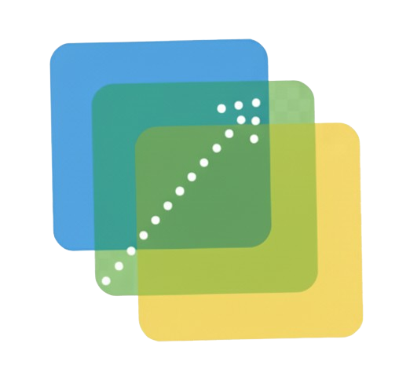
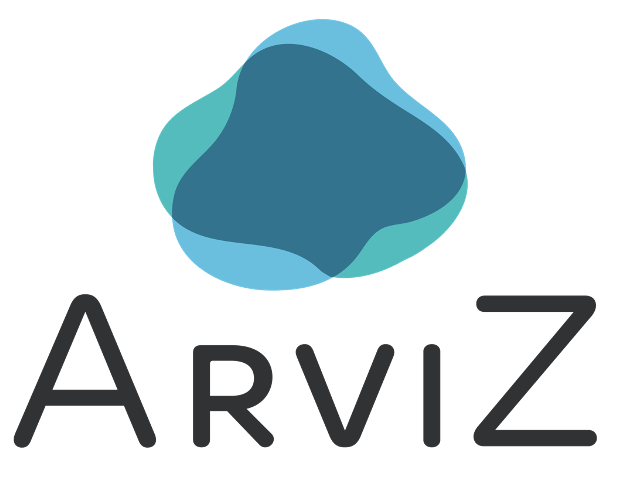
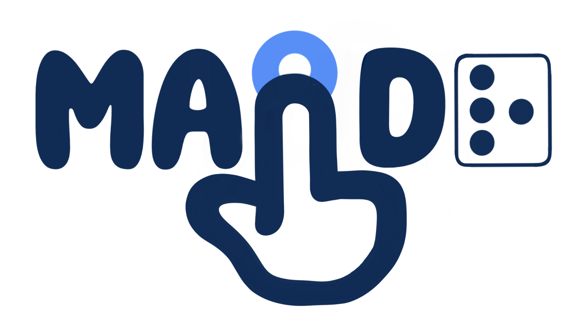

## Hi there, I am [Yilin Xia](https://yilinxia.com/)

I am a Ph.D. student advised by Dr. Bertram Ludäscher and Dr. Matthew Turk in the School of Information Sciences at the University of Illinois at Urbana-Champaign.

I am broadly interested in Data Management, Knowledge Representation & Reasoning, and Data Visualization aiming to address data challenges through a Declarative Approach. My research is supported in part by GitHub Secure Open Source Fund, Google Academic Research Grants, Gemini Academic Program, and NumFOCUS Small Development Grants.

<table>
  <tr height="300px">
    <!-- Card 1: DeepGit -->
    <td>
      <table>
        <tr>
          <td width="250px" height="110px" valign="top" colspan="4">
            

              <a href="https://github.com/data-exp-lab/deepgit">
                 
              </a>
            

            <a href="https://github.com/data-exp-lab/deepgit"><strong>DeepGit</strong></a>: Exploration and Discovery of Research Software with Human-Curated Graphs
              ⚡ Visual Interface, GraphRAG
          </td>
        </tr>
        <tr>
          <td align="center" valign="middle">
            
          </td>
          <td align="center" valign="middle">
             5
          </td>
        </tr>
      </table>
    </td>
    <!-- Card 2: DecViz -->
    <td>
      <table>
        <tr>
          <td width="250px" height="110px" valign="top" colspan="4">
            

              <a href="https://github.com/yilinxia/DecViz">
                 
              </a>
            

            <a href="https://github.com/yilinxia/DecViz"><strong>DecViz</strong></a>: Transforms knowledge into graphs using declarative programming
              ⚡ Formalization, Visualization
          </td>
        </tr>
        <tr>
          <td align="center" valign="middle">
          </td>
          <td align="center" valign="middle">
             5
          </td>
        </tr>
      </table>
    </td>
    <!-- Card 3: Logica -->
    <td>
      <table>
        <tr>
          <td width="250px" height="110px" valign="top" colspan="4">
            

              <a href="https://github.com/evgskv/logica">
                 
              </a>
            

            <a href="https://github.com/evgskv/logica"><strong>Logica</strong></a>: A logic programming language that compiles to SQL and runs on DuckDB, BigQuery ...
              ⚡ Query Language, SQL
          </td>
        </tr>
        <tr>
          <td align="center" valign="middle">
            
          </td>
          <td align="center" valign="middle">
             5
          </td>
        </tr>
      </table>
    </td>
  </tr>
  <tr height="300px">
    <!-- Card 4: XRAY -->
    <td>
      <table>
        <tr>
          <td width="250px" height="110px" valign="top" colspan="4">
            

              <a href="https://github.com/idaks/xray">
                 
              </a>
            

            <a href="https://github.com/idaks/xray"><strong>XRAY</strong></a>: A visual interface designed to Instantiate and Explain Abstract Argumentation Framework
              ⚡ Graph Reasoning, XAI
          </td>
        </tr>
        <tr>
          <td align="center" valign="middle">
            
          </td>
          <td align="center" valign="middle">
             5
          </td>
        </tr>
      </table>
    </td>
    <!-- Card 5: ArgSemX -->
    <td>
      <table>
        <tr>
          <td width="250px" height="110px" valign="top" colspan="4">
            

              <a href="https://github.com/xai-ca/argsemx">
                 
              </a>
            

            <a href="https://github.com/xai-ca/argsemx"><strong>ArgSemX</strong></a>: An interactive web app for exploring Argumentation Framework semantics
              ⚡ Argumentation Semantics
          </td>
        </tr>
        <tr>
          <td align="center" valign="middle">
          </td>
          <td align="center" valign="middle">
             5
          </td>
        </tr>
      </table>
    </td>
    <!-- Card 6: CrowdIdea -->
    <td>
      <table>
        <tr>
          <td width="250px" height="110px" valign="top" colspan="4">
            

              <a href="https://crowdidea-8dcsa.ondigitalocean.app/">
                 
              </a>
            

            <a href="https://github.com/arviz-devs/arviz_dashboard"><strong>CrowdIdea</strong></a>: Application fuses crowd insights, analytics, and causal exploration.
              ⚡ Crowd Reasoning, Graphs
          </td>
        </tr>
        <tr>
          <td align="center" valign="middle">
            
          </td>
          <td align="center" valign="middle">
            
          </td>
        </tr>
      </table>
    </td>
  </tr>

  
  <tr height="300px">
  <!-- Card 7: ArviZ Dashboard -->
    <td>
      <table>
        <tr>
          <td width="250px" height="110px" valign="top" colspan="4">
            

              <a href="https://github.com/arviz-devs/arviz_dashboard">
                 
              </a>
            

            <a href="https://github.com/arviz-devs/arviz_dashboard"><strong>ArviZ Dashboard</strong></a>: Bayesian Dashboard for exploratory analysis of Bayesian models
              ⚡ Bayesian Analysis, Model Comparison, Panel
          </td>
        </tr>
        <tr>
          <td align="center" valign="middle">
            
          </td>
          <td align="center" valign="middle">
             5
          </td>
        </tr>
      </table>
    </td>
    <!-- Card 8: MAIDR -->
    <td>
      <table>
        <tr>
          <td width="250px" height="110px" valign="top" colspan="4">
            

              <a href="https://github.com/xability/maidr">
                 
              </a>
            

            <a href="https://github.com/xability/maidr"><strong>MAIDR</strong></a>: Multimodal Access and Interactive Data Representation for accessible visualizations
              ⚡ Accessibility, Multimodal, Data Visualization
          </td>
        </tr>
        <tr>
          <td align="center" valign="middle">
            
          </td>
          <td align="center" valign="middle">
             5
          </td>
        </tr>
      </table>
    </td>
    <!-- Card 9: Jupyterlab NodeEditor -->
    <td>
      <table>
        <tr>
          <td width="250px" height="110px" valign="top" colspan="4">
            

              <a href="https://github.com/cropsinsilico/jupyterlab_nodeeditor">
                 
              </a>
            

            <a href="https://github.com/cropsinsilico/jupyterlab_nodeeditor"><strong>JLNE</strong></a>: Node-based Visual Programming Powered Jupyter Extension for Domain Experts
              ⚡ JupyterLab, Node Editor, Visual Programming
          </td>
        </tr>
        <tr>
          <td align="center" valign="middle">
            
          </td>
          <td align="center" valign="middle">
             5
          </td>
        </tr>
      </table>
    </td>
    
  </tr>
</table>
